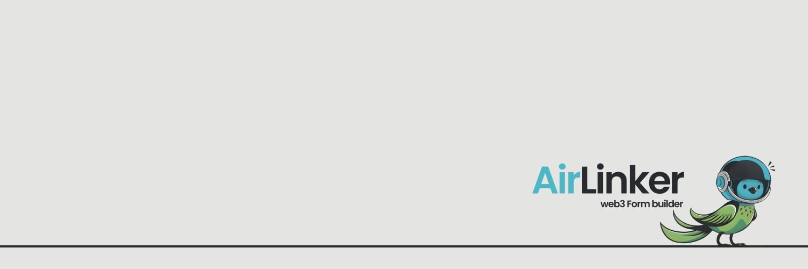

# 

# Airlinker Frontend

Welcome to the frontend of Airlinker, a Web3-powered platform enabling users to create and interact with decentralized forms, games, and more. This project integrates with blockchain technology to provide a secure, decentralized experience for all users.

## Features

- **Decentralized Forms:** Create, distribute, and manage forms on-chain.
- **Web3 Wallet Integration:** Connect your wallet to interact with the platform.
- **Customizable Widgets:** Add various components to your forms, including text inputs, multiple-choice questions, and wallet connect buttons.
- **Real-time Updates:** Experience fast and responsive UI updates.
- **Secure Storage:** Data is stored securely using decentralized technologies.

## Getting Started

### Prerequisites

Ensure you have the following installed:

- Node.js (v14.x or later)
- npm (v6.x or later) or Yarn

### Installation

Clone the repository and install dependencies:

```bash
git clone https://github.com/abdulkadirerdem/airlinker.git
cd airlinker
npm install
```

### Running the Project

To start the development server:

```bash
npm run dev
```

The app will be available at `http://localhost:3000`.

### Building for Production

To build the project for production:

```bash
npm run build
```

The built files will be output to the `dist` directory.

### Running Tests

To run the tests:

```bash
npm run test
```

## Project Structure

```markdown
src/
│
├── components/ # Reusable UI components
├── app/ # Next.js pages
├── assets/ # Global assets that are statically used
├── auth/ # auth layouts
├── hooks/ # custom hooks
├── layouts/ # custom client side layouts
├── section/ # custom client side sections
├── theme/ # theme configurations
├── utils/ # util functions
└── ...
```

## Technologies Used

- **React** - A JavaScript library for building user interfaces.
- **Next.js** - A React framework with server-side rendering and static site generation.
- **Solana Web3.js** - JavaScript API for interacting with the Solana blockchain.
- **MUI** - Material-UI for React, for building responsive UI components.
- **React Query** - Data-fetching and caching for React applications.

## Contact

For any inquiries, please reach out to the project team:

- **AirLinker Official X Account** - [@airrlinker](https://x.com/AirrLinker)
